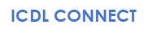

<!-- PROJECT LOGO -->
 

    

  <h3 align="center">ICDL CONNECT</h3>

  

    ICDL CONNECT est un projet d'interconnexion des acteurs intervenants dans l'organisation des Formations ICDL!
     
    <a href="https://github.com/othneildrew/Best-README-Template"><strong>Explore the docs »</strong></a>
     
     
    <a href="https://github.com/othneildrew/Best-README-Template">Voir la démo</a>
    ·
    <a href="https://github.com/othneildrew/Best-README-Template/issues">Retourner un bug </a>
    ·
  

<!-- ABOUT THE PROJECT -->
## A propos du projet

[![Product Name Screen Shot][product-screenshot]]

<!-- MARKDOWN LINKS & IMAGES -->
<!-- https://www.markdownguide.org/basic-syntax/#reference-style-links -->
[license-shield]: https://img.shields.io/github/license/othneildrew/Best-README-Template.svg?style=flat-square
[license-url]: https://github.com/othneildrew/Best-README-Template/blob/master/LICENSE.txt
[linkedin-shield]: https://img.shields.io/badge/-LinkedIn-black.svg?style=flat-square&logo=linkedin&colorB=555
[product-screenshot]: images/screenshot.jpg
